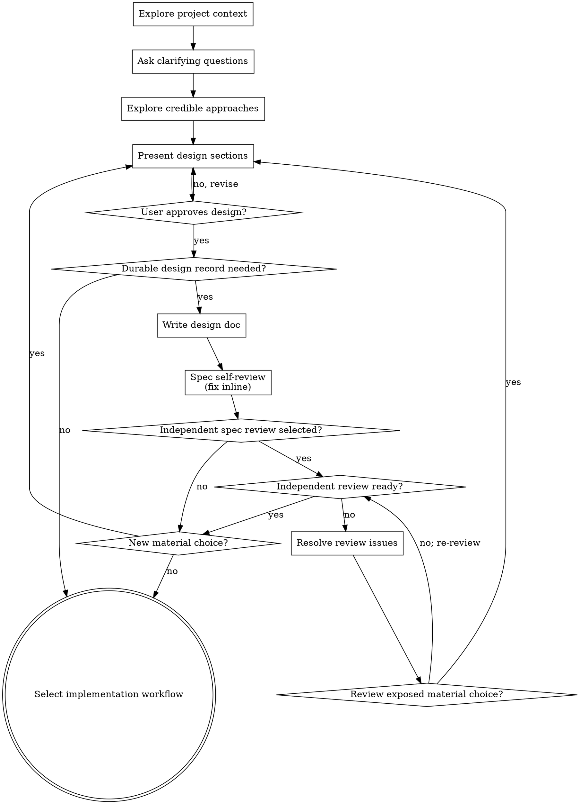

# Brainstorming Ideas Into Designs

## APEX boundary

This leaf owns intent clarification and material design decisions. It consumes the active APEX design gate and documentation decision; it does not assign risk, authorize implementation, or create a durable spec unless APEX or repository truth requires one. Without a full decision record, the `using-apex` lightweight boundary applies.

Help turn ideas into fully formed designs and specs through natural collaborative dialogue.

Understand project context, refine decisions that cannot be derived mechanically, then obtain approval for the material design direction.

<HARD-GATE>
When this skill's trigger matches, do not implement until the user approves the material design direction. An accepted spec or explicit prior approval satisfies the gate. Routine fixes, mechanical implementation, and low-risk edits with no new design decision do not require this skill.
</HARD-GATE>

## Proportionate Gate

Use the active governance skill's classification when present. Human approval governs material intent and design choices, not facts available from code, tests, accepted specs, or repository conventions.

## Checklist

For substantial or multi-stage design work, track these items as tasks. For a short decision, follow the same order without manufacturing a task list:

1. **Explore project context** — check files, docs, recent commits
2. **Offer the visual companion just-in-time** — NOT upfront. The first time a question would genuinely be clearer shown than described, offer it then (its own message); on approval its browser tab opens for you. If no visual question ever arises, never offer it. See the Visual Companion section below.
3. **Ask clarifying questions** — one at a time, understand purpose/constraints/success criteria
4. **Explore credible approaches** — compare alternatives when materially viable ones exist
5. **Present design** — scale it to complexity and obtain approval at meaningful decision boundaries
6. **Persist the design when needed** — only when governance, repository convention, future coordination, or decision durability requires it
7. **Spec self-review** — quick inline check for placeholders, contradictions, ambiguity, scope (see below)
8. **Independent spec review when selected** — require contract-aware readiness before planning
9. **Resolve new material choices** — do not request duplicate approval for faithful transcription
10. **Transition to implementation** — use writing-plans when a durable plan is justified

## Process Flow

Use writing-plans for substantial work that needs a durable plan. Otherwise transition to the appropriate implementation workflow with the approved design as its boundary.

## The Process

**Understanding the idea:**

- Check out the current project state first (files, docs, recent commits)
- Before asking detailed questions, assess scope: if the request describes multiple independent subsystems (e.g., "build a platform with chat, file storage, billing, and analytics"), flag this immediately. Don't spend questions refining details of a project that needs to be decomposed first.
- If the project is too large for a single spec, help the user decompose into sub-projects: what are the independent pieces, how do they relate, what order should they be built? Then brainstorm the first sub-project through the normal design flow. Each sub-project gets its own spec → plan → implementation cycle.
- For appropriately-scoped projects, ask questions one at a time to refine the idea
- Prefer multiple choice questions when possible, but open-ended is fine too
- Only one question per message - if a topic needs more exploration, break it into multiple questions
- Focus on understanding: purpose, constraints, success criteria

**Exploring approaches:**

- Compare materially viable alternatives; do not manufacture options to satisfy a count
- Present options conversationally with your recommendation and reasoning
- Lead with your recommended option and explain why

**Presenting the design:**

- Once you believe you understand what you're building, present the design
- Scale each section to its complexity: a few sentences if straightforward, up to 200-300 words if nuanced
- Ask at meaningful decision boundaries whether the direction looks right; do not manufacture approval checkpoints for settled details
- Cover: architecture, components, data flow, error handling, testing
- Be ready to go back and clarify if something doesn't make sense

**Design for isolation and clarity:**

- Break the system into smaller units that each have one clear purpose, communicate through well-defined interfaces, and can be understood and tested independently
- For each unit, you should be able to answer: what does it do, how do you use it, and what does it depend on?
- Can someone understand what a unit does without reading its internals? Can you change the internals without breaking consumers? If not, the boundaries need work.
- Smaller, well-bounded units are also easier for you to work with - you reason better about code you can hold in context at once, and your edits are more reliable when files are focused. When a file grows large, that's often a signal that it's doing too much.

**Working in existing codebases:**

- Explore the current structure before proposing changes. Follow existing patterns.
- Where existing code has problems that affect the work (e.g., a file that's grown too large, unclear boundaries, tangled responsibilities), include targeted improvements as part of the design - the way a good developer improves code they're working in.
- Don't propose unrelated refactoring. Stay focused on what serves the current goal.

## After the Design

**Documentation:**

- Resolve the design location in this order: repository convention, active governance convention, then `docs/design/YYYY-MM-DD-<topic>-design.md` when a durable design record is justified.
- Update or link the active source of truth; do not create a parallel dated spec beside an existing spec, design, matrix, or decision-record topology.
- When active governance supplies a spec profile, apply it only to a required
  durable contract source; do not transcribe the same approved design into a
  second artifact.
- The date records establishment, not immutability: update the file while it represents the same living decision; for a material replacement where history matters, create a new dated design and cross-link `Supersedes` / `Superseded by` status.
- Write the design in direct, concise language
- Commit only when authorized by the active Git workflow; keep the change in a coherent logical commit.

**Spec Self-Review:**
After writing the spec document, look at it with fresh eyes:

1. **Placeholder scan:** Any "TBD", "TODO", incomplete sections, or vague requirements? Fix them.
2. **Internal consistency:** Do any sections contradict each other? Does the architecture match the feature descriptions?
3. **Scope check:** Is this focused enough for a single implementation plan, or does it need decomposition?
4. **Ambiguity check:** Could a requirement be interpreted two ways? Resolve
   non-material wording from accepted context. Return any material alternative
   to the user decision gate instead of choosing it silently.
5. **Proportionality check:** Does the document expand unneeded detail or copy
   another source of truth? Link it and keep this artifact focused.

Fix any issues inline. No need to re-review — just fix and move on.

Dispatch `spec-document-reviewer-prompt.md` only when active governance lists
`spec review` in `selected_mechanisms`. For a subagent dispatch, also require
`spec-document-reviewer` in `delegated_roles` and supported, authorized
read-only delegation. Pass both the resolved artifact path and governing spec
contract. If the selected independent review cannot be performed, stop at that
boundary rather than substituting controller self-review.

An `Issues Found` result blocks planning. Fix every non-material review issue
within the approved direction, then re-run the selected review. Route any newly
exposed material choice through the user review gate, update the artifact after
approval, and then re-review. Proceed
only after `Ready for planning`; readiness never grants design approval or edit
authority.

**User Review Gate:**
Ask again only if writing, self-review, or independent review exposed a new material choice or changed the approved direction:

> "While recording the design, this material choice emerged: <choice and tradeoff>. Which direction should govern?"

Otherwise report where the approved design was recorded and continue; faithful transcription is not a second approval gate.

**Implementation:**

- Invoke writing-plans when governance or task complexity requires a durable plan; otherwise use the relevant implementation workflow.

## Key Principles

- **One question at a time** - Don't overwhelm with multiple questions
- **Multiple choice preferred** - Easier to answer than open-ended when possible
- **YAGNI without scope loss** - Remove over-design, unrequested extensions, and invented options. Never use YAGNI to omit a user-requested or spec-defined capability, evaluation, API, or data semantic. If the requested scope needs reduction, decompose it or surface the material tradeoff for approval; do not narrow it silently.
- **Explore real alternatives** - Compare credible directions without manufacturing options
- **Incremental validation** - Present design, get approval before moving on
- **Be flexible** - Go back and clarify when something doesn't make sense

## Visual Companion

A browser-based companion for showing mockups, diagrams, and visual options during brainstorming. Available as a tool — not a mode. Accepting the companion means it's available for questions that benefit from visual treatment; it does NOT mean every question goes through the browser.

**Offering the companion (just-in-time):** Do NOT offer it upfront. Wait until a question would genuinely be clearer shown than told — a real mockup / layout / diagram question, not merely a UI *topic*. The first time that happens, offer it then, as its own message:
> "This next part might be easier if I show you — I can put together mockups, diagrams, and comparisons in a browser tab as we go. It's still new and can be token-intensive. Want me to? I'll open it for you."

**This offer MUST be its own message.** Only the offer — no clarifying question, summary, or other content. Wait for the user's response. If they accept, start the server with `--open` so their browser opens to the first screen automatically. If they decline, continue text-only and don't offer again unless they raise it.

**Per-question decision:** Even after the user accepts, decide FOR EACH QUESTION whether to use the browser or the terminal. The test: **would the user understand this better by seeing it than reading it?**

- **Use the browser** for content that IS visual — mockups, wireframes, layout comparisons, architecture diagrams, side-by-side visual designs
- **Use the terminal** for content that is text — requirements questions, conceptual choices, tradeoff lists, A/B/C/D text options, scope decisions

A question about a UI topic is not automatically a visual question. "What does personality mean in this context?" is a conceptual question — use the terminal. "Which wizard layout works better?" is a visual question — use the browser.

If they agree to the companion, read the detailed guide before proceeding:
`visual-companion.md`
