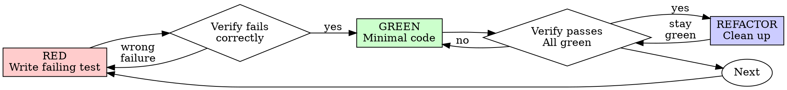

# Test-Driven Development (TDD)

## APEX boundary

This leaf owns the red-green-refactor mechanism when a failing automated test can credibly define the changed contract. It consumes APEX scope, authority, and verification decisions; it cannot relabel work as testable or non-testable to change governance. Without a full decision record, the `using-apex` lightweight boundary applies.

## Overview

Write the test first. Watch it fail. Write minimal code to pass.

**Core principle:** If you didn't watch the test fail, you don't know if it tests the right thing.

**Violating the letter of the rules is violating the spirit of the rules.**

## Governance Boundary

This skill governs work only when its trigger matches: a failing automated test can credibly define the changed behavior before implementation. Risk tier alone does not make TDD applicable, and a low tier does not excuse skipping it after the trigger matches.

When active governance defines a different verification path for work outside this trigger—such as prose or styling changes, non-behavioral edits, exploratory spikes, or local wiring already covered by reliable tests—follow that path instead. Record the substitute verification when reporting completion. Governance cannot be used to hide an unverified behavior claim or to relabel testable behavior as non-testable.

## When to Use

Use for the portions of a feature, bug fix, refactor, or behavior change whose
contract can be credibly expressed by a failing automated test before the
implementation edit. Do not expand this list into prose, generated output,
exploration, or behavior already covered by stronger existing evidence.

**Potential exceptions (follow active governance, or ask your human partner when no governing decision exists):**
- Throwaway prototypes
- Generated code
- Configuration files
- Non-behavioral prose, styling, comments, and mechanical wiring
- Exploration whose result will be discarded before production implementation

Thinking "skip TDD just this once"? Stop. That's rationalization.

## The Iron Law (Within This Skill's Trigger)

```
NO PRODUCTION CODE WITHOUT A FAILING TEST FIRST
```

If you wrote uncommitted agent-authored code before the test, and deletion is
within the granted edit authority, revert that code and restart from the failing
test. Never delete pre-existing or user-authored work to enforce this workflow;
instead disclose the missed RED evidence and use the strongest credible
regression verification now available.

## Red-Green-Refactor



### RED - Write Failing Test

Write one minimal test showing what should happen.

<Good>
```typescript
test('retries failed operations 3 times', async () => {
  let attempts = 0;
  const operation = () => {
    attempts++;
    if (attempts < 3) throw new Error('fail');
    return 'success';
  };

  const result = await retryOperation(operation);

  expect(result).toBe('success');
  expect(attempts).toBe(3);
});
```
Clear name, tests real behavior, one thing
</Good>

<Bad>
```typescript
test('retry works', async () => {
  const mock = jest.fn()
    .mockRejectedValueOnce(new Error())
    .mockRejectedValueOnce(new Error())
    .mockResolvedValueOnce('success');
  await retryOperation(mock);
  expect(mock).toHaveBeenCalledTimes(3);
});
```
Vague name, tests mock not code
</Bad>

**Requirements:**
- One behavior
- Clear name
- Real code (no mocks unless unavoidable)

### Verify RED - Watch It Fail

**MANDATORY. Never skip.**

```bash
npm test path/to/test.test.ts
```

Confirm:
- Test fails (not errors)
- Failure message is expected
- Fails because feature missing (not typos)

**Test passes?** You're testing existing behavior. Fix test.

**Test errors?** Fix error, re-run until it fails correctly.

### GREEN - Minimal Code

Write simplest code to pass the test.

<Good>
```typescript
async function retryOperation<T>(fn: () => Promise<T>): Promise<T> {
  for (let i = 0; i < 3; i++) {
    try {
      return await fn();
    } catch (e) {
      if (i === 2) throw e;
    }
  }
  throw new Error('unreachable');
}
```
Just enough to pass
</Good>

<Bad>
```typescript
async function retryOperation<T>(
  fn: () => Promise<T>,
  options?: {
    maxRetries?: number;
    backoff?: 'linear' | 'exponential';
    onRetry?: (attempt: number) => void;
  }
): Promise<T> {
  // YAGNI
}
```
Over-engineered
</Bad>

Don't add features, refactor other code, or "improve" beyond the test.

### Verify GREEN - Watch It Pass

**MANDATORY.**

```bash
npm test path/to/test.test.ts
```

Confirm:
- Test passes
- Other tests still pass
- Output pristine (no errors, warnings)

**Test fails?** Fix code, not test.

**Other tests fail?** Fix now.

### REFACTOR - Clean Up

After green only:
- Remove duplication
- Improve names
- Extract helpers

Keep tests green. Don't add behavior.

### Repeat

Next failing test for next feature.

## Good Tests

| Quality | Good | Bad |
|---------|------|-----|
| **Minimal** | One thing. "and" in name? Split it. | `test('validates email and domain and whitespace')` |
| **Clear** | Name describes behavior | `test('test1')` |
| **Shows intent** | Demonstrates desired API | Obscures what code should do |

## Red Flags - STOP and Start Over

- Code before test
- Test after implementation
- Test passes immediately
- Can't explain why test failed
- Tests added "later"
- Rationalizing "just this once"
- "I already manually tested it"
- "Tests after achieve the same purpose"
- "It's about spirit not ritual"
- "Keep as reference" or "adapt existing code"
- "Already spent X hours, deleting is wasteful"
- "TDD is dogmatic, I'm being pragmatic"
- "This is different because..."

Within the active TDD scope, these signal missing RED evidence. Restart only the
authorized uncommitted agent-authored portion; otherwise report and repair the
evidence gap without deleting existing work.

## Verification Checklist

Before marking work complete:

- [ ] Every changed contract in this TDD scope has a test
- [ ] Watched each test fail before implementing
- [ ] Each test failed for expected reason (feature missing, not typo)
- [ ] Wrote minimal code to pass each test
- [ ] All tests pass
- [ ] Output pristine (no errors, warnings)
- [ ] Tests use real code (mocks only if unavoidable)
- [ ] Edge cases and errors covered

If a box cannot be checked, report the missing evidence. Restart only the
authorized, uncommitted agent-authored portion when doing so is safe.

## When Stuck

| Problem | Solution |
|---------|----------|
| Don't know how to test | Write wished-for API. Write assertion first. Ask your human partner. |
| Test too complicated | Design too complicated. Simplify interface. |
| Must mock everything | Code too coupled. Use dependency injection. |
| Test setup huge | Extract helpers. Still complex? Simplify design. |

## Debugging Integration

Bug found? Write failing test reproducing it. Follow TDD cycle. Test proves fix and prevents regression.

For a bug whose regression can be credibly expressed by a failing automated
test, use that test before the fix. Otherwise follow the APEX-selected
verification path and record why a pre-fix automated regression was not
credible.

## Testing Anti-Patterns

When adding mocks or test utilities, read [testing-anti-patterns.md](testing-anti-patterns.md) to avoid common pitfalls:
- Testing mock behavior instead of real behavior
- Adding test-only methods to production classes
- Mocking without understanding dependencies

## Final Rule

```
Production code → test exists and failed first
Otherwise → not TDD
```

Outside this skill's trigger, follow the APEX-selected verification path without
manufacturing a new approval gate.
